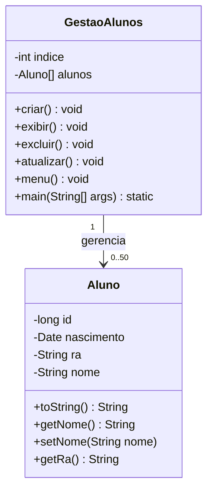

# Sistema-de-Gest-o-de-Alunos-Student-Management-System-

Descrição

    Este projeto é uma aplicação de console desenvolvida em Java 21 para gerenciar registros de alunos. O sistema permite
    realizar operações completas de CRUD (Criação, Leitura, Atualização e Exclusão) utilizando uma estrutura de dados de array fixo, 
    demonstrando conceitos fundamentais de Programação Orientada a Objetos (POO) e manipulação de memória.

Funcionalidades

    Criar: Adiciona um novo aluno com ID, Nome, RA e Data de Nascimento.
    Exibir: Busca e exibe os dados de um aluno através do RA.
    Atualizar: Permite modificar o nome e a data de nascimento de um aluno existente.
    Remover: Exclui um aluno do sistema, reorganizando o array para manter a integridade dos dados.
    Menu Interativo: Interface via terminal com loop infinito para navegação.

----------------------------------------------------------------------------------------------------------------------------------------------------

Description

    This project is a Java 21 console application designed to manage student records. 
    The system performs full CRUD operations (Create, Read, Update, and Delete) using a fixed-size array data structure. 
    It serves as a practical implementation of Object-Oriented Programming (OOP) fundamentals and memory management.

Features

    Create: Adds a new student with ID, Name, RA (Registration Number), and Date of Birth.
    Display: Searches for and shows student details based on their RA.
    Update: Allows modification of an existing student's name and birth date.
    Remove: Deletes a student from the system, shifting array elements to maintain data consistency.
    Interactive Menu: A terminal-based interface with an infinite loop for seamless navigation.

----------------------------------------------------------------------------------------------------------------------------------------------------

Tecnologias (Technologies)

    Java 21
    Gradle (Gerenciador de Dependências / Build Tool)
    JUnit 5 (Testes Unitários / Unit Testing)

    
